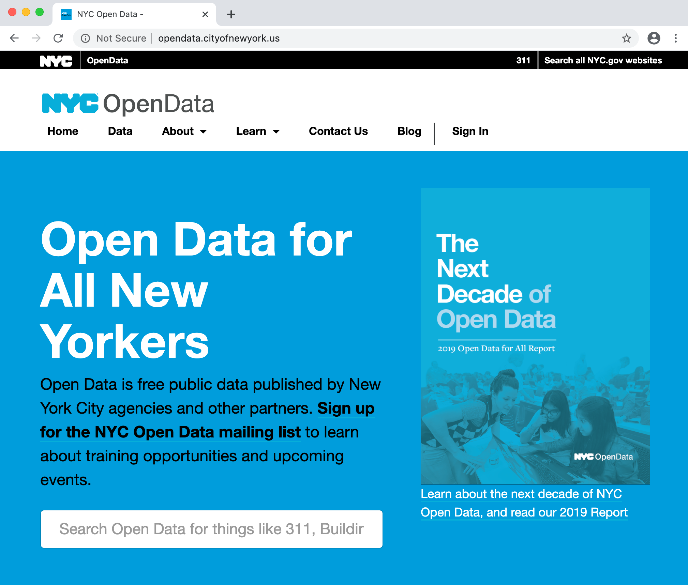
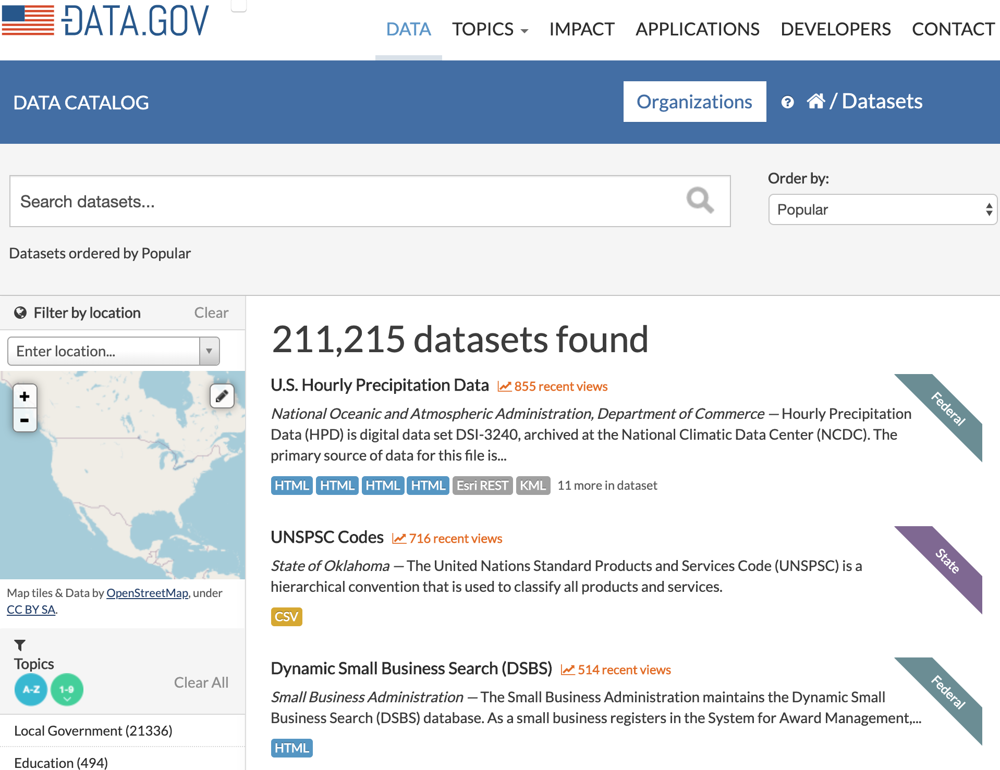
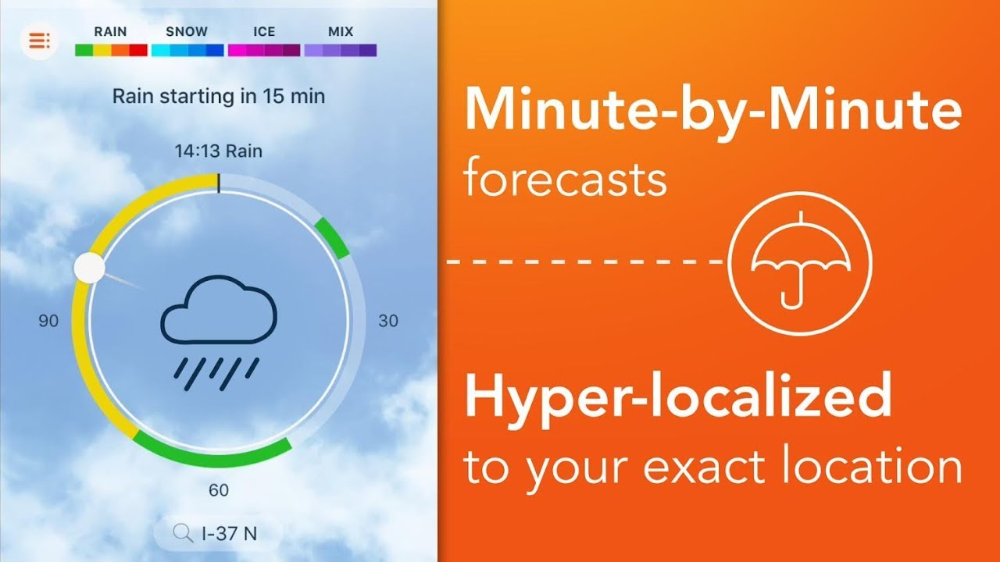
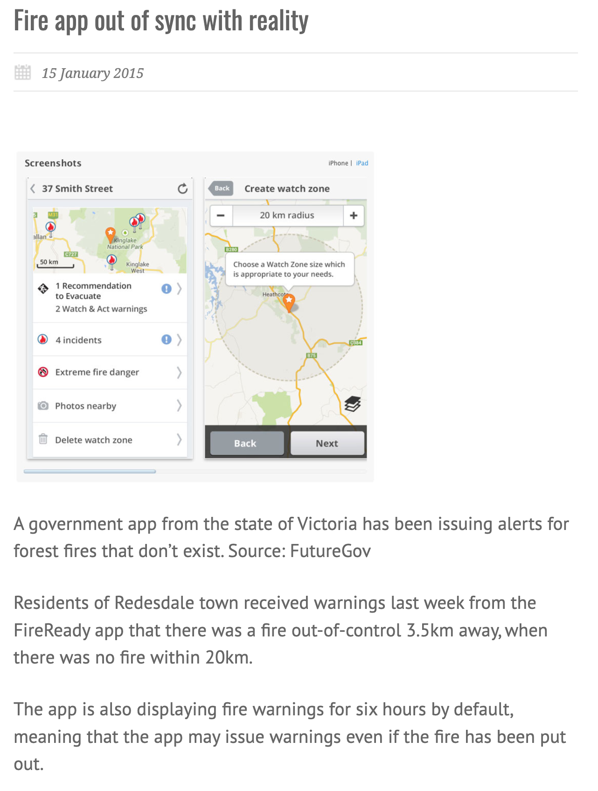

layout:true

  
  
Seeing Your City in Data

  

    
    
      
      

<!-- 

  
  
Seeing Dallas in Data: An Introduction to Open Data in DFW

  

    Seeing Dallas in Data: An Introduction to Open Datain DFW by <a xmlns:cc="http://creativecommons.org/ns#" href="http://www.datapolitan.com" property="cc:attributionName" rel="cc:attributionURL">Richard Dunks</a> is licensed under a <a rel="license" href="http://creativecommons.org/licenses/by-sa/4.0/">Creative Commons Attribution-ShareAlike 4.0 International License</a>.
  

 -->

--

class: center,middle

# Seeing Your City in Data: An Introduction to Open Data

- - -

## Presenter: Richard Dunks

##### &nbsp;

### Follow along at: https://bit.ly/seeing-city-in-data

#### See the code at: https://bit.ly/seeing-city-in-data-code

<strong><strong>Seeing Your City in Data: An Introduction to Open Data</strong></strong> by <a xmlns:cc="http://creativecommons.org/ns#" href="http://www.datapolitan.com" property="cc:attributionName" rel="cc:attributionURL">Richard Dunks</a> is licensed under a <a rel="license" href="http://creativecommons.org/licenses/by-sa/4.0/">Creative Commons Attribution-ShareAlike 4.0 International License</a>

---

class:center,middle
# Welcome!

---

exclude:true
# A Few Ground Rules
+ Step up, step back
+ Be curious and ask questions!
+ Assume noble regard and positive intent
+ Respect multiple perspectives 
+ Listen deeply
+ Be present (phone, email, social media, etc.)

---
exclude:true
# Introduce Yourself to Your Neighbor
+ Who are you?
+ What brings you here today?
+ Tell us about when a statistic surprised you

---

# Goals for today
--

+ Practice working with open data
--

+ Provide some background on open data
--

+ Discuss the main elements of open data
--

+ Show some meaningful uses of open data

---
exclude:true

# The Value of Data
+ Data tells a story about something that's happened
+ Can describe what happened directly or indirectly

---

# So Let's Work with Some Open Data
--

---

class:center,middle
# [The NYC Open Data Portal](https://opendata.cityofnewyork.us/)

---

exclude:true

# Some DFW Open Data Portals

+ <a href="http://data-arlingtontx.opendata.arcgis.com/" target="_blank">City of Arlington</a>
+ <a href="https://www.dallasopendata.com/" target="_blank">City of Dallas</a>
+ <a href="http://data.cityofdenton.com/" target="_blank">City of Denton</a>
+ <a href="https://data.fortworthtexas.gov/" target="_blank">City of Fort Worth</a>
+ <a href="http://data-garland.opendata.arcgis.com/" target="_blank">City of Garland</a>
+ <a href="http://data-cityofirving.opendata.arcgis.com/" target="_blank">City of Irving</a>
+ <a href="http://mckinneygis-mck.opendata.arcgis.com/" target="_blank">City of McKinney</a>
+ <a href="http://opendata-richardson.opendata.arcgis.com/" target="_blank">City of Richardson</a>
+ <a href="https://data.texas.gov/" target="_blank">State of Texas</a>
+ <a href="http://data-nctcoggis.opendata.arcgis.com/" target="_blank">North Central Texas Council of Governments</a>

???
+ [Denton County Transportation Authority](https://dcta.net/resources/open-data)

---

class:center,middle
# What did you think about this experience?
# How would you define "open data"?

---

name:open-data
# Definition of Open Data
--

> Open data is data that can be freely used, shared and built-on by anyone, anywhere, for any purpose

## - [Open Knowledge International](http://blog.okfn.org/2013/10/03/defining-open-data/)

---

# Key Features of Open Data
--

+ Availability and access
--

.caption[[Data.gov](https://www.data.gov/)]

---

# Key Features of Open Data
+ Availability and access
+ Reuse and redistribution
--

.caption[[data.world](https://data.world/)]

---

# Key Features of Open Data
+ Availability and access
+ Reuse and redistribution
+ Universal participation
--

---

# Benefits of Open Data
--

+ Transparency
--

---

# Benefits of Open Data
+ Transparency
+ Releasing social and commercial value
--

.caption[[AccuWeather](https://www.accuweather.com/)]

---

# Benefits of Open Data
+ Transparency
+ Releasing social and commercial value

.caption[[TransitApp.com](https://transitapp.com/)]

---

# Benefits of Open Data
+ Transparency
+ Releasing social and commercial value

.caption[Source: [NPR](https://www.npr.org/sections/thesalt/2015/03/27/395622262/did-that-restaurant-pass-its-health-inspection-now-yelp-will-tell-you)]

---

# Benefits of Open Data
+ Transparency
+ Releasing social and commercial value
+ Participation and engagement
--

.caption[[Voting Information Project](https://www.votinginfoproject.org/)]

---

class:center,middle

# Open Data Concerns

---

# Privacy
--

+ Personally identifiable information (PII)
--

.caption[Source: [Wired Magazine](https://www.wired.com/2013/07/mugshot-removal-extortion/)]

---

# Privacy
+ Personally identifiable information (PII)

.caption[Source: [Gawker](http://gawker.com/the-public-nyc-taxicab-database-that-accidentally-track-1646724546)]

---

# Privacy
+ Personally identifiable information (PII)

.caption[Source: [The Interdisciplinary Internet Institute](https://web.archive.org/web/20150318175539/http://theiii.org/index.php/997/using-nyc-taxi-data-to-identify-muslim-taxi-drivers/)]

---

# Privacy
+ Personally identifiable information (PII)
+ [Mosaic Effect](https://fcw.com/articles/2014/05/13/fose-mosaic.aspx)
--

.caption[The Center for Government Excellence's [Privacy Matrix](https://govex.jhu.edu/wiki/privacy_matrix/)]

---

# Reliability
--

+ Accuracy
--

.caption[Source: [TimberBiz](https://www.timberbiz.com.au/fire-app-sync-reality/)]

---

# Reliability
+ Accuracy
+ Timeliness
--

.caption[[NOAA National Climatic Data Center](https://www.ncdc.noaa.gov/cdo-web/)]

---

# Security
--

+ Identify sensitive infrastructure
--

.caption[[Open Sewer Atlas](http://openseweratlas.tumblr.com/map)]

---

exclude:true
class:center,middle
# 5 MIN BREAK

---

class:center, middle
# Let's Pick One of the Datasets and Explore It

???
Activity: Facilitator guides participants through an example exercise in filtering and downloading a dataset from an open data portal

Task to participants: We're going to choose one of the datasets you found and go through the process of filtering and downloading the data. We'll use this as an example of how to get data out of a portal. Later, I'm going to ask you to find your own dataset and do the same thing.

Outcome: Participants are familiar with how to filter and download data from the example open data portal

Format: Facilitated guided task and group discussion

---

exclude:true
# 5 Data Analytics Tasks
1. Filtering
2. Sorting
3. Aggregating (PivotTable)
4. Transforming
5. Visualizing

---

# What is Analysis?
--

> “Analysis is simply the pursuit of understanding, usually through detailed inspection or comparison”

## - [Carter Hewgley](https://www.linkedin.com/in/carterhewgley)

---

exclude:true
# Your Turn
+ Select a dataset of your own or continue working with this dataset
+ Find a story in the data that you want to share (should be interesting to you)
+ Be prepared to share your story with the group
+ I'm here to help
+ Have fun

---

exclude:true
class:center,middle
# Presentations

---

class:center,middle
# Wrap-up

---

# What We've Covered
--

+ What is Open Data
--

+ Demonstrated an Open Data Portal
--

+ What else?

---

class: center,middle

# What can be done with open data?

---

# Examples
--

+ [Living Lots NYC (formerly 596 Acres)](http://livinglotsnyc.org/)
--

+ [Twitter NYC: A Multilingual City](http://ny.spatial.ly)
--

+ [NYC Taxis: A Day in the Life](http://chriswhong.github.io/nyctaxi/)
--

+ [theMap.io](https://themap.io/) - Robert Mundinger

---

# What I've Done with Open Data
--

+ [Rudin Center Job Access](http://www.datapolitan.com/job_access/)
--

+ [Subway Transit Sheds in NYC](http://richard-datapolitan.cartodb.com/viz/c0d4f39e-962e-11e4-9b3b-0e9d821ea90d/embed_map)
--

+ [MTA Subway Station Status](http://www.datapolitan.com/mta_station_repair_status/)
--

+ [Citibike Dock Status Twitter Bot](https://twitter.com/CitiBikedocks)

---

# Resources
--

+ [Open Data Handbook](http://opendatahandbook.org/)
--

+ [State of the Union of Open Data](https://www.datafoundation.org/the-state-of-the-union-of-open-data-ed-3)
--

+ [Ancient Origins of Open Access Law](https://opengovdata.io/2014/ancient-origins-open-access-to-law/) by [Joshua Tauberer](https://razor.occams.info/)
--

+ [A Brief History of Open Data](http://parisinnovationreview.com/articles-en/a-brief-history-of-open-data) by [Simon Chignard](https://donneesouvertes.info/) in the Paris Innovation Review
--

+ [OpenRefine](http://openrefine.org/) - A powerful tool for working with messy data

---

# Open Data Portal Vendors
--

+ [Socrata](https://socrata.com/)
--

+ [OpenGov](https://opengov.com/products/open-data)
--

+ [ESRI](https://www.esri.com/en-us/arcgis/products/arcgis-open-data)
--

+ [OpenDataSoft](https://www.opendatasoft.com/)
--

+ [Datopian](https://datopian.com/)

---

# Final Thoughts
--

+ Data can tell a story, but doesn't speak for itself
--

+ Some data is better than no data, but good data is better than bad data
--

+ [PDFs are where data goes to die](https://twitter.com/cshirky/status/1061010907)

---

class:middle,center
# Thank You!

<!-- ## Especially [GoodWork](https://goodwork.co/)! -->

---

# Contact Information
+ [Email me](mailto:richard[at]datapolitan[dot]com)
+ Check out [my website](http://wwww.datapolitan.com)
+ Connect on [Twitter](https://twitter.com/Datapolitan)
+ Connect on [LinkedIn](https://www.linkedin.com/in/richarddunks/)
+ Follow us on [Instagram](https://www.instagram.com/datapolitan/)
+ Follow us on [Eventbrite](https://www.eventbrite.com/o/datapolitan-18675558166) to learn about workshops

---

exclude:true 
class:center,middle
# Feedback
## [Please take a moment to let us know what you think](https://docs.google.com/forms/d/e/1FAIpQLSesE1EWZw55FwS5-rPwhk4ETp3XoUuiniy36Jj1edhE8ZyG2g/viewform?usp=sf_link)

---
exclude:true
# Application Program Interface (API)

[Credit: Zapier "An Introduction to APIs"](https://zapier.com/learn/apis/) 
---
exclude:true

# Application Program Interface (API)

---
exclude:true

# Web Scraping

[Introduction to web scraping by Thomas Levine](http://thomaslevine.com/dada/web-sites-to-data-tables/)
---
exclude:true

# Web Scraping

[Web Scraping with OpenRefine video from Eric Brelsford](http://www.youtube.com/watch?v=KQlCTo0Q71Q)

---
exclude:true

class:middle,center

# If it's online, you can get the data
## &nbsp;

---
exclude:true

class:middle,center

# If it's online, you can get the data
## Trust me

---
exclude:true

class:middle,center

Source: http://arstechnica.com/tech-policy/2010/03/why-google-makes-it-easy-to-leave-google/

---
exclude:true
class:center,middle
# Concerns with Open Data

---
exclude:true

# Reliability
+ Veracity of source
+ Currency of data

---
exclude:true

# Privacy
+ Personally identifiable information (PII)

https://www.wired.com/2013/07/mugshot-removal-extortion/

---
exclude:true

# Privacy
+ Personally identifiable information (PII)

http://gawker.com/the-public-nyc-taxicab-database-that-accidentally-track-1646724546 

---
exclude:true

# Privacy
+ Personally identifiable information (PII)

http://www.theiii.org/index.php/997/using-nyc-taxi-data-to-identify-muslim-taxi-drivers/ 

---
exclude:true

# Privacy
+ Personally identifiable information (PII)
+ Mosaic Effect

---
exclude:true

# Confidentiality
+ Proprietary information
+ Trade secrets
+ Government procurement information

---
exclude:true

# Security
+ Identify sensitive infrastructure

http://openseweratlas.tumblr.com/map

---
exclude:true

# Security
+ Identify sensitive infrastructure
+ Describe methods and procedures

---
exclude:true
# When Good Data Goes Bad

.caption[Image Credit: Kenny Louie, [CC BY 2.0](http://creativecommons.org/licenses/by/2.0), via [Wikimedia Commons](https://commons.wikimedia.org/wiki/File%3ANYC_TAXI_(7038011669).jpg)]

[Gawker matches Taxi and Limousine Data with Paparazzi Photos](http://gawker.com/the-public-nyc-taxicab-database-that-accidentally-track-1646724546)

---
exclude:true
class:center,middle
# Quick History of Open Data

---
exclude:true
# Why do we publish laws?

---
exclude:true
class:center,middle
# What good are laws if we don't know how they're implemented?
## &nbsp;

---
exclude:true
class:center,middle
# What good are laws if we don't know how they're implemented?
## Which is what data tells us

---
exclude:true
class:center,middle

Source: [Meet the Fire Hydrant that Unfairly Nets NYC $25,000 a Year](http://iquantny.tumblr.com/post/83696310037/meet-the-fire-hydrant-that-unfairly-nets-nyc)

<!-- -
class:center,middle

# Modern History of Open Data

Source: http://fcw.com/articles/2014/06/09/exec-tech-brief-history-of-open-data.aspx?admgarea=TC_ExecTech
 -->
---
exclude:true
# Contributors to the Open Data Movement
+ Open science
+ Open-source software
<!-- 
class:center,middle

Source: <a target='_blank' href='http://www.paulvanslembrouck.com?utm_source=visually_embed'>ptvan</a>

 -->
---
exclude:true
class:center,middle
# Open Data Sources
## &nbsp;

---
exclude:true

class:center,middle
# Open Data Sources
## In order of usability

---
exclude:true

# Open Data Portals

---
exclude:true
class:center,middle
# Link to NYC Open Data Portal for Exercise
## <a href="https://opendata.cityofnewyork.us/" target="_blank">NYC Open Data Portal</a>

---
exclude:true
# Data for Exercise

#### [Click to download if you have problems](data/20160101_20160331_311NoiseContains.csv)

---

exclude:true
# Exercise
## Looking at the type, frequency, and location of noise-related service requests:
+ Find one thing that you expected in the data
+ Find one thing you found surprising in the data
